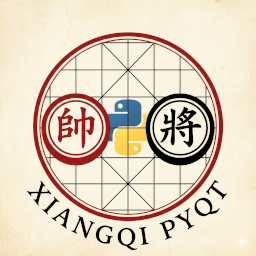

# 中国象棋 GUI



一个基于 PyQt5 开发的中国象棋图形界面程序，可使用 [皮卡鱼 (Pikafish)](https://github.com/official-pikafish/Pikafish) 或其他支持UCI协议的引擎。

## 功能特性

### 对弈功能

- **人机对弈**：与皮卡鱼引擎进行对弈，可调节引擎思考时间
- **人人对弈**：支持双人本地对弈
- **引擎对战**：支持引擎自我对弈

### 棋盘操作

- **翻转棋盘**：切换红方/黑方视角
- **走法提示**：引擎分析当前局面并给出建议走法及评分，左侧展示胜率条
- **悔棋功能**：撤销走法，支持智能悔棋（人机对弈时自动撤销引擎的走法）
- **上一步/下一步**：浏览历史走法

### 局面编辑

- **棋盘编辑器**：自由摆放棋子，设置任意局面
- **导入/导出 FEN**：支持 FEN 格式的局面导入导出
- **清空棋盘**：一键清空所有棋子
- **初始局面**：快速恢复到开局位置

### 棋谱管理

- **保存棋谱**：导出对局为 PGN 格式文件
- **打开棋谱**：导入 PGN 格式的棋谱文件
- **走法记录**：实时显示中文着法记录，支持点击跳转

### 游戏控制

- **认输**：主动认输结束对局
- **提和**：提出和棋请求
- **和棋判定**：自动检测三次重复局面、六十回合无吃子等和棋条件
- **将死/困毙检测**：自动判断胜负

### 引擎信息

- 实时显示引擎搜索深度、评分、搜索速度
- 显示引擎主要变着 (PV)

### 分析模式

- **全局分析**：对整盘棋进行后台分析，生成分数走势图
- **分数图表**：可视化展示红黑双方的优劣势变化（左侧区域为黑方优势，右侧为红方优势）
- **快速跳转**：点击图表上的数据点可直接跳转到对应的棋局位置


## 安装与运行

### 依赖

- Python 3.8+
- PyQt5

### 安装依赖

```
pip install PyQt5
```

### 运行程序

```
python main.py
```

### 游戏与引擎设置

1. **引擎路径**：选择 UCI 协议引擎的可执行文件（如 Pikafish）
2. **思考时间**：设置引擎每一步的思考时间限制（毫秒）
   - 设置为 0 表示不限时间（仅受深度限制）
3. **思考深度**：设置引擎搜索的最大深度
   - 设置为 0 表示不限深度
4. **线程数**：设置引擎使用的 CPU 线程数

*注意：思考时间与深度可以同时设置，引擎将在达到任一条件时停止思考。*

## 文件说明

| 文件                | 说明               |
| ------------------- | ------------------ |
| `main.py`         | 程序入口           |
| `main_window.py`  | 主窗口界面逻辑     |
| `board_widget.py` | 棋盘绘制与交互组件 |
| `chess_logic.py`  | 象棋规则与走法验证 |
| `move_history.py` | 走法记录组件       |
| `uci_engine.py`   | UCI 引擎通信接口   |
| `settings.json`   | 用户设置配置文件   |

## 操作说明

### 走子

- 点击己方棋子选中，再点击目标位置走子
- 绿色圆点表示可走位置，绿色圆圈表示可吃子位置

### 编辑模式

- 左键点击棋盘放置选中的棋子
- 右键点击棋盘删除棋子

### 快捷操作

- 双击走法记录可跳转到对应局面

## 许可证

GPLv3 License
